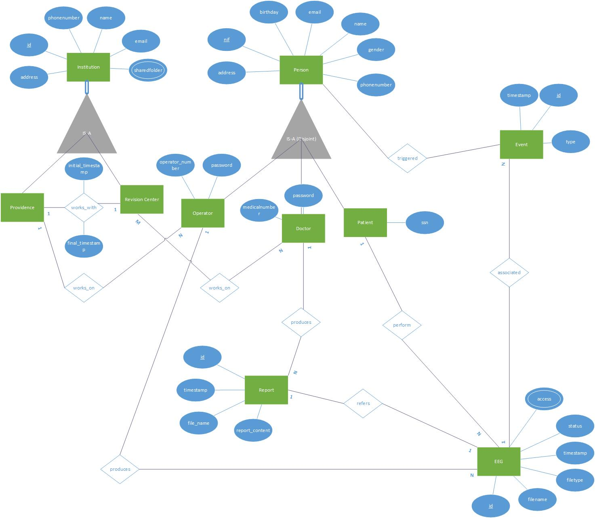
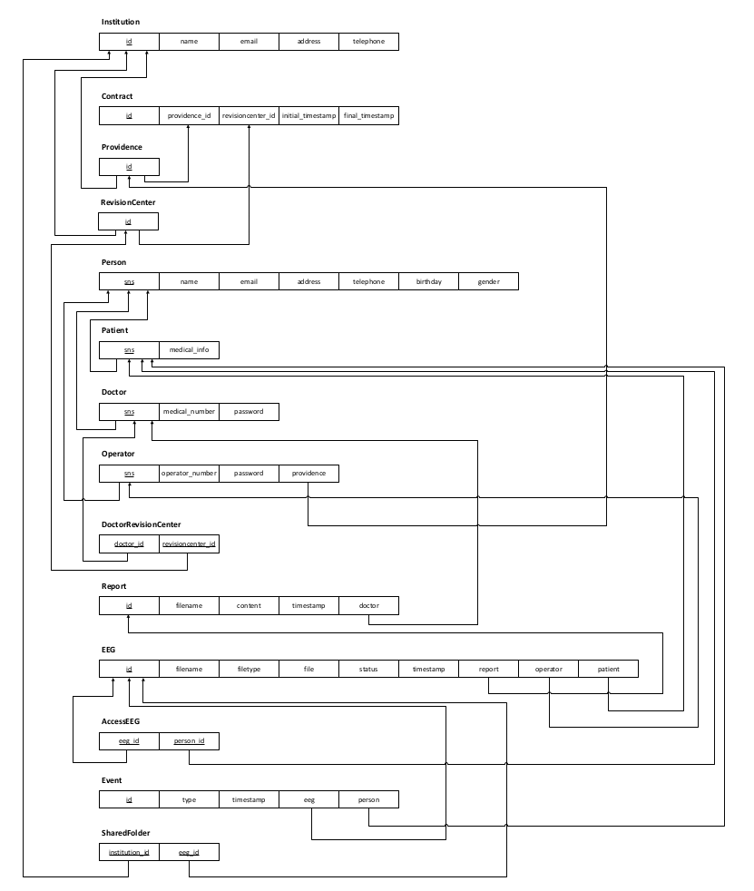
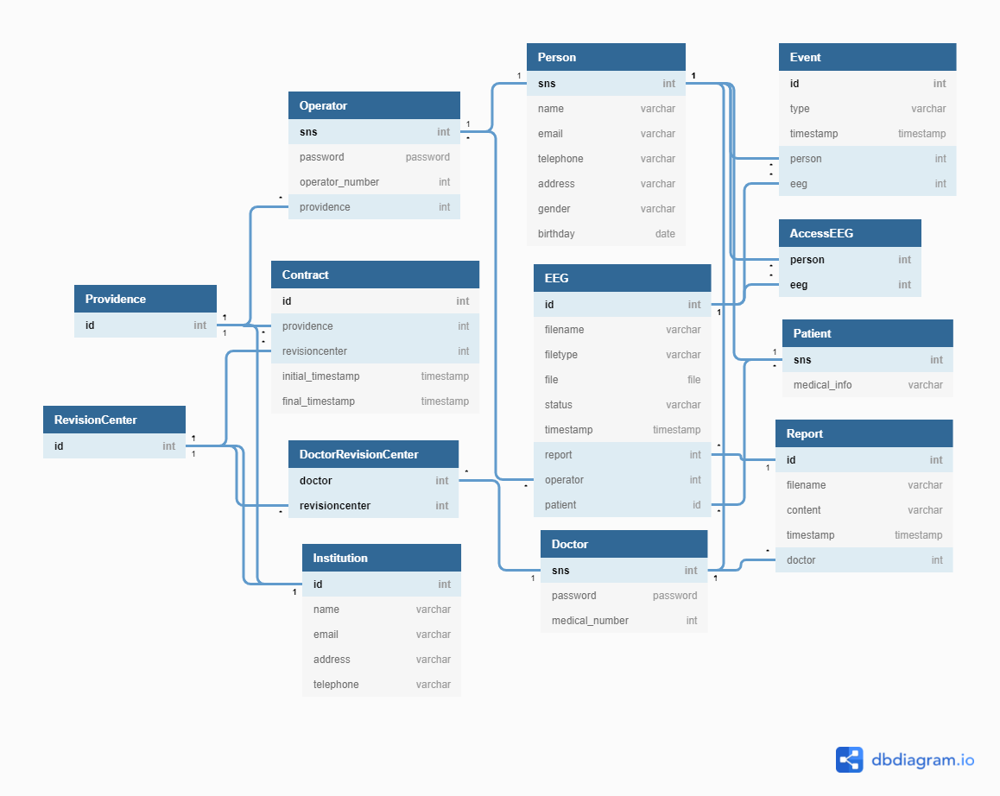

# BeegBrain
## Developed by Big Brains

## Authors

| Nome | Função | Email | Nmec |
| :---: | :---: | :---: | :---: |
| Mariana Rosa | Product Owner | marianarosa@ua.pt | 98390 |
| João Reis | Team Manager | joaoreis16@ua.pt | 98474 |
| João Farias | Architect | joaobernardo0@ua.pt | 98679 |
| Ricardo Rodriguez | DevOps Master | ricardorodriguez@ua.pt | 98388 |

## Architecture

### Architecture Diagram

## DataBase Model

### DER Diagram

### ER Diagram

### Domain Model Diagram

### Use cases Diagram 

### Deployment Diagram 

This diagram is a draft.
### Frontend

Our frontend will be developed using Angular.

### Backend

#### REST API

The service layer of our web-app is a **Django** based REST API.

### Database

We store all our data on a **mySQL** database.
